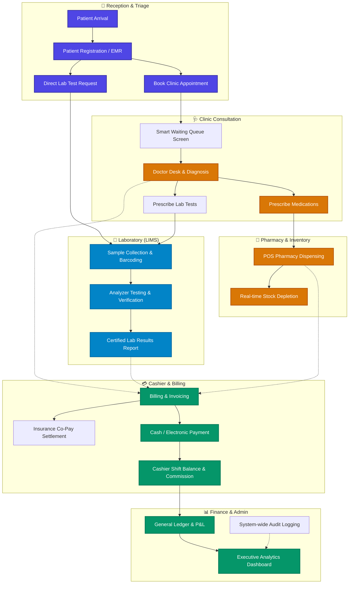

<div align="center">

# 🏥 Al-Wahat HIS & LIMS
### **Enterprise Healthcare Information & Laboratory Management System**
#### **نظام الواحات الصحي المتكامل لإدارة المستشفيات، العيادات، والمختبرات الطبية**

[](https://www.php.net/)
[](https://www.mysql.com/)
[](https://getbootstrap.com/)
[](https://jquery.com/)
[-10b981?style=for-the-badge)](#-internationalization--localization)
[](#-license)
[](#)

<p align="center">
  <a href="#-project-overview">Overview</a> •
  <a href="#-key-modules--features">Key Modules</a> •
  <a href="#-system-architecture">Architecture</a> •
  <a href="#-tech-stack">Tech Stack</a> •
  <a href="#-installation--setup">Setup</a> •
  <a href="#-database-configuration">Database</a> •
  <a href="#-developer--credits">Developer</a>
</p>

---

</div>

## 📖 Project Overview

**Al-Wahat HIS & LIMS** is an all-in-one, enterprise-grade Hospital Information System (HIS) and Laboratory Information Management System (LIMS) designed specifically for modern healthcare facilities, polyclinics, diagnostic centers, and specialized laboratories.

The platform unifies patient registration, dynamic outpatient appointment scheduling, audio-visual queue waiting screens, end-to-end specimen collection and diagnostic testing, point-of-sale pharmacy dispensing, medical insurance claims settlement, human resource management, and double-entry financial reporting into a seamless, high-performance ecosystem.

### 🌟 Core Highlights
- 🔬 **Precision Laboratory Workflow**: Complete specimen tracking lifecycle from request and collection to barcode labeling, analyzer testing, verified result entry, and customized medical reports.
- 🩺 **Patient-Centric EMR**: Centralized Electronic Medical Records covering full clinical history, previous lab results, prescriptions, and financial balances.
- 🔊 **Smart Clinic Queue & Calling Screen**: Interactive real-time waiting room display with automatic chime voice notifications (`call_ring.mp3`).
- 💳 **Advanced Financial Accounting**: Automated double-entry journals, cashier shift closures with commission calculation, patient refund handling, and profit/loss analytics.
- 🛡️ **Medical Insurance Management**: Flexible tariff matrices, policy ceilings, corporate co-payments, and automated batch claim submissions.
- 🌐 **True Bilingual Experience**: Full native Right-to-Left (RTL) Arabic and Left-to-Right (LTR) English interfaces powered by `Tajawal` and modern typography.
- 🔐 **Granular Role-Based Access Control (RBAC)**: Fine-grained permissions per user and page, reinforced with comprehensive audit logging.

---

## 🚀 Key Modules & Features

```
┌────────────────────────────────────────────────────────────────────────────────────────┐
│                                 AL-WAHAT HEALTHCARE HUB                                │
├──────────────────────────┬───────────────────────────┬─────────────────────────────────┤
│ 🩺 Clinical & Reception  │ 🔬 Laboratory (LIMS)      │ 💊 Pharmacy & Inventory         │
│ • Patient EMR & Triage   │ • Test Catalog & Ranges   │ • Multi-Store Warehousing       │
│ • Clinic Appointments    │ • Specimen Barcoding      │ • POS Prescription Billing      │
│ • Calling Screen & Audio │ • Multi-Component Results │ • Expiry & Batch Control        │
│ • Nurse Station Desk     │ • Diagnostic Reports      │ • Purchase Orders & Returns     │
├──────────────────────────┼───────────────────────────┼─────────────────────────────────┤
│ 🛡️ Medical Insurance     │ 💰 Finance & Accounting   │ 👥 Human Resources (HRM)        │
│ • Corporate Contracts    │ • Shift Handover & Comms  │ • Staff Roster & RBAC           │
│ • Dynamic Rate Lists     │ • General Ledger & P&L    │ • Attendance & Leave Tracking   │
│ • Co-Pay Calculations    │ • Patient & Lab Refunds   │ • Salary Advances & Loans       │
│ • Claims Settlement      │ • Supplier Accounts       │ • Automated Payroll Slips       │
└──────────────────────────┴───────────────────────────┴─────────────────────────────────┘
```

### 1. 🔬 Laboratory Information Management System (LIMS)
- **Test Catalog & Parameter Profiles**: Configure single tests, composite panels, units of measurement, reference ranges (by age/gender), and normal bounds.
- **Sample Barcode Generation**: Direct printing of standardized barcode labels for specimen tubes (`print_barcode_label.php`).
- **Sample Tracking Lifecycle**: Real-time stage monitoring: `Requested` ➔ `Collected` ➔ `Processing` ➔ `Completed` ➔ `Approved`.
- **Diagnostic Result Builder**: Fast tabular result capture with automated flags for abnormal or critical values.
- **Medical Report Printing**: Professional, hospital-branded laboratory result sheets with doctor digital signatures and QR verification.

### 2. 🩺 Clinic & Patient Management (EMR)
- **Patient Registration & Identity**: Unique patient identifiers, demographic tracking, contact records, and emergency data.
- **Doctor Appointments & Schedules**: Bookings by clinic, doctor specialization, shift, and time slots.
- **Smart Queue Display**: Public waiting room screen with patient turn calling and pleasant acoustic chime alerts (`waiting_screen.php`).
- **Clinical Consultations & History**: Outpatient (OPD) and Inpatient (IPD) clinical notes, diagnoses, prescriptions, and test orders.

### 3. 💊 Pharmacy & Multi-Store Inventory
- **POS Cashier Terminal**: Fast-paced barcode point of sale with instant drug lookup, pricing, and invoice generation.
- **Medicine Catalog & Seed Data**: Pre-loaded pharmaceutical database with dosage forms, scientific names, and therapeutic classes.
- **Expiry & Low-Stock Alerts**: Proactive notifications before medicines reach critical expiry dates or drop below re-order thresholds.
- **Supply Chain Management**: Supplier profile directories, purchase orders (PO), receipt verification, stock transfers, and stock reconciliations.

### 4. 🛡️ Insurance & Corporate Billing Engine
- **Insurance Companies & Policies**: Multi-tier coverage models, deductible limits, co-insurance percentages, and exclusion rules.
- **Bulk Pricing & Tariff Management**: Flexible service price lists categorized by corporate contract tier.
- **Claims Settlement Flow**: Batch generation of insurance claims, reconciliation, rejection adjustments, and payment tracking.

### 5. 💰 Finance, Cashier Shifts & Accounting
- **Shift Management & Handover**: Secure cashier shifts, opening floating balances, cash reconciliations, and automated shift commission splits.
- **Supplier Ledger & Accounts Payable**: Detailed statement of accounts, payment installments, aging reports, and balance tracking.
- **Profit & Loss Dashboard**: Granular revenue analytics segregated by department (Clinics, Lab, Pharmacy, Emergency).
- **Patient Refunds**: Authorized refund processing for canceled appointments, tests, or returned pharmaceuticals.

### 6. 👥 Human Resources Management (HRM) & Payroll
- **Staff Directory**: Complete employment records, clinical designations, credentials, and contracts.
- **Payroll Automation**: Calculation of gross pay, loans, deductions, bonuses, commissions, and formatted payslip generation.
- **Staff Loans & Extras**: Integrated loan amortization and overtime tracking linked directly to monthly payroll.

### 7. 🔒 Enterprise Security & Audit Intelligence
- **Deep Audit Logging**: Automated tracking of all CRUD actions with user ID, module, target object, IP address, timestamp, and HTTP method (`rpos_audit_logs`).
- **Granular Page Permissions**: Super Admin interface to toggle access to every page per staff member.
- **Defensive Engineering**: Prepared SQL statements (`mysqli`), CSRF protection tokens, input sanitization, and SHA1/MD5 credential hashing.

---

## 🏗️ System Architecture & Workflow



---

## 💻 Tech Stack

| Layer | Technologies | Details |
| :--- | :--- | :--- |
| **Backend Engine** |  | Native PHP (7.4 - 8.2+), Object-Oriented & Procedural blend, Prepared MySQLi statements |
| **Database** |  | Relational Schema, InnoDB engine, `utf8mb4_unicode_ci` full Arabic collation |
| **Frontend Framework** |  | Argon Theme, Responsive Grid, Modern Glassmorphic Cards |
| **Scripting & Interactivity** |   | Dynamic DOM manipulation, AJAX asynchronous calls, modal dialogues |
| **Icons & Typography** |  | FontAwesome Icons, Nucleo Icons, Google Tajawal Arabic Font |
| **Audio / Multimedia** |  | Patient calling audio chime system (`call_ring.mp3`) |
| **Barcode & QR** |  | Tube specimen label printing & thermal receipt layout engine |
| **Server Compatibility** |   | XAMPP, WampServer, Laragon, or standalone Linux LAMP/LEMP stacks |

---

## 📁 Project Structure

```bash
his-lab-system/
├── index.php                      # Main landing page & multi-role login portal
├── session.php                    # Session state handler
├── session_init.php               # Global session configuration
├── style.css                      # Global foundational stylesheets
├── js_main.js                     # Core frontend JavaScript routines
├── js_check.js                    # Form validation & asynchronous checks
├── error-404.php                  # Customized error fallthrough page
└── pos/
    └── admin/
        ├── dashboard.php          # Primary administrative & operations dashboard
        ├── executive_dashboard.php# Executive KPIs & performance analytics
        ├── clinic_queue.php       # Real-time clinic queue manager
        ├── waiting_screen.php     # Public waiting room calling screen (audio-visual)
        ├── patient.php            # Patient registration & EMR profiles
        ├── patient_history.php    # Detailed chronological medical records
        ├── lab_management.php     # Laboratory tests, parameters & result entry
        ├── lab_sample_tracking.php# Barcode specimen tracking lifecycle
        ├── pos.php                # Pharmacy point-of-sale terminal
        ├── products.php           # Pharmaceutical catalog & inventory
        ├── shift_management.php   # Cashier shift opening, closing & commission
        ├── finance_dashboard.php  # Financial analytics & cash-flow overview
        ├── profit_loss.php        # Comprehensive profit & loss accounting
        ├── insurance_management.php # Insurance contracts & claims engine
        ├── hrm.php                # Human resources & staff directory
        ├── payroll.php            # Staff payroll calculation & disbursement
        ├── audit_logs.php         # Real-time enterprise security audit trails
        ├── settings.php           # System parameters & clinic profile config
        ├── assets/                # CSS, SCSS, Fonts, Vendor scripts, Logos & Audio
        ├── config/
        │   ├── config.php         # Database connection, helpers & auto-migrations
        │   ├── languages.php      # Bilingual translations dictionary (AR / EN)
        │   └── checklogin.php     # Authentication guard middleware
        └── partials/
            ├── _head.php          # HTML meta, responsive styles & assets
            ├── _topnav.php        # Header navigation bar & user profile menu
            ├── _sidebar.php       # Dynamic modular navigation sidebar
            ├── _footer.php        # Modern footer with developer attribution
            └── _scripts.php       # Global script dependencies
```

---

## ⚙️ Installation & Setup

Follow these steps to deploy **Al-Wahat HIS & LIMS** on your local machine or production server:

### 1. Prerequisites
- **Web Server**: Apache 2.4+ or Nginx
- **PHP**: Version `7.4` to `8.2` (with `mysqli`, `mbstring`, `json`, `gd` extensions enabled)
- **Database**: MySQL `5.7+` or MariaDB `10.3+`
- **Tooling (Optional)**: XAMPP, WampServer, Laragon, or Docker

### 2. Clone the Repository
```bash
git clone https://github.com/msimoo/his-lab-system.git
cd his-lab-system
```

### 3. Setup Database
1. Launch MySQL via phpMyAdmin or terminal.
2. Create a UTF-8 Unicode database:
```sql
CREATE DATABASE alwahat CHARACTER SET utf8mb4 COLLATE utf8mb4_unicode_ci;
```
3. Import your initial database schema file (if provided) or allow the application's auto-migrator in `pos/admin/config/config.php` to initialize essential tables automatically upon your first launch.

### 4. Configure Database Credentials
Edit `pos/admin/config/config.php`:
```php
$dbuser = "root";       // Your MySQL database username
$dbpass = "";           // Your MySQL database password
$host   = "localhost";  // Database server host
$db     = "alwahat";    // Target database name
```

### 5. Launch the Server
- **Using PHP Built-in Server**:
  ```bash
  php -S localhost:8888
  ```
- **Using Apache (XAMPP / WAMP / Laragon)**:
  Move the directory to your web root (`htdocs` or `www`) and access:
  ```text
  http://localhost/his-lab-system
  ```

---

## 🔐 Default Access & User Roles

The system features intelligent multi-role redirection from the root login portal (`index.php`):

| Role | Access Scope | Default Landing |
| :--- | :--- | :--- |
| **Super Admin** | Unrestricted access across all clinical, financial, HRM & system settings | `pos/admin/dashboard.php` |
| **Doctor / Clinic** | Patient medical records, appointments, clinic queue, lab & medicine orders | `pos/admin/doctor_appointments.php` |
| **Lab Specialist** | Specimen collection, barcode labels, test results entry & result verification | `pos/admin/lab_management.php` |
| **Cashier / Reception**| Patient check-in, shift management, POS billing, receipts & appointment tickets | `pos/admin/shift_management.php` |
| **Pharmacist** | Pharmacy point-of-sale, medicine catalog, stock receiving & expiry alerts | `pos/admin/pos.php` |
| **Accountant** | General ledger, supplier statements, profit/loss reports, financial settings | `pos/admin/finance_dashboard.php` |
| **HR Specialist** | Employee profiles, page permission grants, attendance, loans & payroll slips | `pos/admin/hrm.php` |

---

## 🌐 Internationalization & Localization

Al-Wahat HIS & LIMS provides native bilingual operation:
- **العربية (Arabic)**: Full Right-to-Left (RTL) layout with customized medical terminologies and Arabic typography (`Tajawal`).
- **English**: Left-to-Right (LTR) clean dashboard view.
- Language definitions are centralized in `pos/admin/config/languages.php`, making it straightforward to add new phrases or dialects.

---

## 👨‍💻 Developer Details & Contact

<div align="center">

<table style="border: none; background: transparent;">
  <tr>
    <td align="center" width="220" style="border: none;">
      
      <br><br>
      <b>Mohamed Omer Elsamani</b>
      <br>
      <sub>محمد عمر السماني</sub>
      <br>
      <sub><i>Lead Healthcare Systems Architect</i></sub>
    </td>
    <td style="border: none; padding-left: 24px; vertical-align: middle;">

### 🌟 Mohammed Omer Elsamani
Full-Stack Software Engineer specializing in Healthcare Information Systems (HIS), Clinical Laboratory Solutions (LIMS), Financial Ledgers, and Enterprise Web Applications.

- 🌐 **Portfolio**: [elsamani.rf.gd](https://elsamani.rf.gd/?i=1)
- 🐙 **GitHub**: [@msimoo](https://github.com/msimoo)
- 📦 **Repository**: [msimoo/his-lab-system](https://github.com/msimoo/his-lab-system)
- 📧 **Email**: [elsamaniomer@gmail.com](mailto:elsamaniomer@gmail.com)
- 📱 **Phone / WhatsApp**: `+249 127 941 569`
- 📍 **Location**: Khartoum, Sudan 🇸🇩

[](https://elsamani.rf.gd/?i=1)
[](https://github.com/msimoo)
[](mailto:elsamaniomer@gmail.com)
[](https://wa.me/249127941569)

</td>
  </tr>
</table>

</div>

---

## 🤝 Contributing & Feedback

Contributions, feedback, and feature requests are welcome!
1. Fork the Project: `git checkout -b feature/AmazingFeature`
2. Commit your Changes: `git commit -m 'Add some AmazingFeature'`
3. Push to the Branch: `git push origin feature/AmazingFeature`
4. Open a Pull Request

If you discover any security vulnerabilities or have inquiries regarding customized healthcare deployments, please reach out directly to the developer at [elsamaniomer@gmail.com](mailto:elsamaniomer@gmail.com).

---

## 📄 License & Attribution

This project is developed and maintained by **Mohamed Omer Elsamani**.
Distributed for healthcare clinics, medical facilities, and educational purposes. Review terms and local medical data protection compliance (e.g., HIPAA / GDPR equivalents) prior to live commercial deployment.

<div align="center">

**&copy; 2025 - 2026 Al-Wahat Healthcare System &bull; Designed & Developed with ❤️ by Mohamed Omer Elsamani**

</div>
